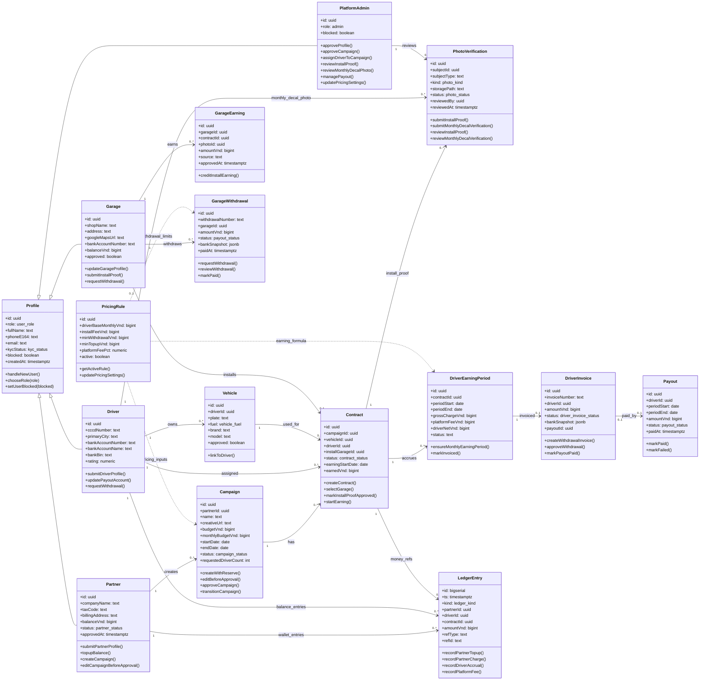

# Biểu Đồ Lớp Theo Cơ Sở Dữ Liệu

## 1. Phạm Vi

Biểu đồ lớp này mô tả các lớp nghiệp vụ chính của demo VehicalAdvertise dựa trên bảng CSDL Supabase và các RPC/server action đang tác động lên dữ liệu. Cách trình bày theo kiểu UML class box: tên lớp, thuộc tính, phương thức và quan hệ bội số.

File import draw.io: `docs/class-diagram.drawio`. File draw.io được tách thành 4 trang để dễ đọc:

- `01 Tài khoản & hồ sơ`
- `02 Campaign & decal`
- `03 Thu nhập Driver`
- `04 Garage & payout`

## 2. Quy Ước Thiết Kế

- `Profile` là lớp cha nghiệp vụ cho tài khoản trong hệ thống. Trong CSDL, các bảng `drivers`, `partners`, `garages` dùng khóa chính trùng `profiles.id`; vì vậy biểu đồ trình bày như quan hệ kế thừa để dễ hiểu trong đồ án.
- `PlatformAdmin` không có bảng riêng; lớp này biểu diễn `profiles.role = admin` và các server action/RPC dành cho Admin.
- `PhotoVerification` ánh xạ từ bảng `photos`. Ảnh sau dán decal và ảnh xác minh decal hằng tháng được phân biệt bằng `photo_kind`.
- `Campaign hết gói` không phải class/use case riêng; chỉ là rule/trạng thái của `Campaign`.
- `Vehicle` vẫn xuất hiện vì `contracts.vehicle_id` tồn tại trong CSDL, nhưng không xem “cập nhật thông tin xe” là use case riêng của Driver.
- Bản draw.io tách trang theo cụm quan hệ để tránh canvas quá dày và đường nối chồng chéo.

## 3. Nhóm Lớp Chính

| Nhóm                   | Lớp                                                                                                  |
| ---------------------- | ---------------------------------------------------------------------------------------------------- |
| Tài khoản và hồ sơ     | `Profile`, `Driver`, `Partner`, `Garage`, `PlatformAdmin`, `Vehicle`                                 |
| Campaign và decal      | `Campaign`, `Contract`, `PhotoVerification`                                                          |
| Thu nhập và thanh toán | `DriverEarningPeriod`, `DriverInvoice`, `Payout`, `GarageEarning`, `GarageWithdrawal`, `LedgerEntry` |
| Cấu hình               | `PricingRule`                                                                                        |

## 4. Biểu Đồ Lớp

## 5. Ghi Chú

- Phương thức trong biểu đồ là RPC/server action chính, không phải method OOP thật trong code.
- Thuộc tính ưu tiên cột nghiệp vụ cần trình bày trong đồ án; CSDL còn một số cột kỹ thuật như timestamp, reviewer, reject reason.
- Các bảng GPS, QR scan, audit log và manual ledger adjustment đã bị loại khỏi scope demo nên không đưa vào biểu đồ lớp tổng quát.
