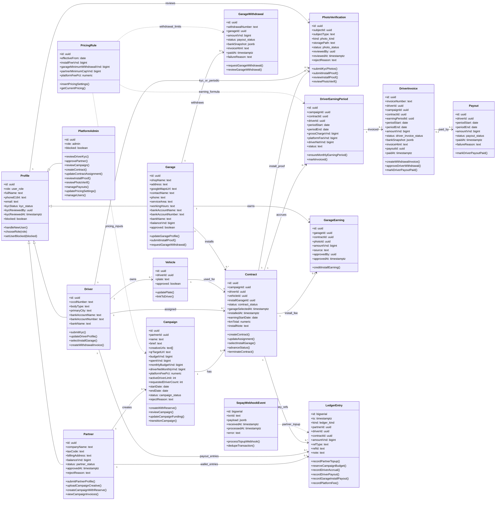

# Biểu Đồ Lớp Theo Cơ Sở Dữ Liệu

## 1. Phạm Vi

Biểu đồ lớp mô tả các lớp nghiệp vụ chính của demo VehicalAdvertise sau khi scout lại codebase. Nguồn chính là `src/types/db.ts`; các migration cuối dùng để xác nhận bảng/cột cũ đã bị loại. File import draw.io: `docs/class-diagram.drawio`.

Bản draw.io được tách thành 4 trang để dễ đọc:

- `01 Tài khoản & hồ sơ`
- `02 Campaign & decal`
- `03 Thu nhập & payout`
- `04 Quản trị & tích hợp`

## 2. Quy Ước

- `Profile` là lớp cha nghiệp vụ cho tài khoản. `Driver`, `Partner`, `Garage` dùng khóa chính trùng `profiles.id`; biểu đồ trình bày như kế thừa để dễ hiểu trong đồ án.
- `PlatformAdmin` không có bảng riêng; đây là `profiles.role = admin` và các server action/RPC dành cho Admin.
- `PhotoVerification` ánh xạ từ bảng `photos`; `photo_kind` phân biệt KYC, install proof và ảnh periodic.
- `SepayWebhookEvent` là bảng log tích hợp nạp tiền, không phải actor trong UML use case/sequence.
- `Vehicle` hiện chỉ giữ `plate` và `approved`; không còn `fuel`, `brand`, `model`.
- `Contract.kmTotal` còn trong CSDL/admin query, nhưng GPS tracking và GPS-based earning đã bị loại khỏi scope demo.
- Thuộc tính dưới đây ưu tiên cột nghiệp vụ và FK quan trọng; một số timestamp kỹ thuật như `created_at` được lược để diagram dễ đọc.

## 3. Nhóm Lớp Chính

| Nhóm                   | Lớp                                                                                                  |
| ---------------------- | ---------------------------------------------------------------------------------------------------- |
| Tài khoản và hồ sơ     | `Profile`, `Driver`, `Partner`, `Garage`, `PlatformAdmin`, `Vehicle`                                 |
| Campaign và decal      | `Campaign`, `Contract`, `PhotoVerification`                                                          |
| Thu nhập và thanh toán | `DriverEarningPeriod`, `DriverInvoice`, `Payout`, `GarageEarning`, `GarageWithdrawal`, `LedgerEntry` |
| Cấu hình và tích hợp   | `PricingRule`, `SepayWebhookEvent`                                                                   |

## 4. Biểu Đồ Lớp

## 5. Ghi Chú

- Phương thức trong biểu đồ là operation nghiệp vụ/server action/RPC tiêu biểu, không phải method OOP thật trong code.
- Không đưa GPS tracking, QR scan, audit log hoặc hệ thống lịch vào class diagram tổng quát vì bảng/luồng đó đã bị drop hoặc không còn scope demo.
- Không đưa `fuel`, `brand`, `model`, `vehicle_fuel`, `driver.rating`, `pricing_rules.active` vì không tồn tại trong schema cuối.
- Partner chỉnh sửa campaign trước duyệt chưa đưa vào method vì scout chưa thấy route/action update campaign từ phía Partner.
- Driver submit ảnh xác minh decal hằng tháng chưa có route/action submit riêng; class vẫn giữ `PhotoVerification.kind = periodic_vehicle/periodic_selfie` vì Admin queue/review đã có.
