# Đồ Án: Biểu Đồ Trình Tự Các Ca Sử Dụng

## 1. Mục Tiêu

Tài liệu này viết lại các sequence diagram theo scope rút gọn mới của dự án VehicalAdvertise. Cách trình bày chính: gom use case theo actor nghiệp vụ, chỉ rõ actor chính, actor phụ, và loại khỏi sơ đồ những phần không còn nằm trong danh sách chức năng bạn cung cấp.

File import draw.io: `docs/sequence-usecases.drawio`.

## 2. Kết Quả Rà Soát Scope

### 2.1 Giữ lại trong đồ án

| Nhóm           | Phần giữ lại                                                                                                                                                                                                                              |
| -------------- | ----------------------------------------------------------------------------------------------------------------------------------------------------------------------------------------------------------------------------------------- |
| Driver         | Đăng ký email/password, đăng nhập, chọn vai trò và hoàn thiện hồ sơ ban đầu, gửi/cập nhật thông tin cá nhân, chờ Admin duyệt hồ sơ, tài khoản nhận tiền, chọn garage, xác thực decal sau dán, gửi ảnh xác minh decal hằng tháng, thu nhập |
| Garage         | Đăng nhập, cập nhật thông tin garage/thanh toán, xem lịch lắp decal, đăng ảnh sau dán decal, xem nguồn thu theo tháng                                                                                                                     |
| Partner        | Đăng ký email/password, đăng nhập, chọn vai trò và hoàn thiện hồ sơ ban đầu, gửi thông tin doanh nghiệp, chờ Admin duyệt hồ sơ, nạp tiền tự động, tạo/chỉnh campaign, dashboard/chi phí                                                   |
| Platform/Admin | Đăng nhập, dashboard hệ thống, duyệt hồ sơ Driver/Partner, duyệt ảnh decal sau dán, duyệt ảnh xác minh decal hằng tháng, hóa đơn, lợi nhuận, gán driver vào campaign, rút tiền driver/garage, thông số hệ thống, người dùng và role       |

### 2.2 Loại khỏi sequence và summary

| Phần cũ                               | Lý do loại                                                                    |
| ------------------------------------- | ----------------------------------------------------------------------------- |
| Theo dõi vị trí hành trình            | Không còn trong scope mới; code hiện chỉ còn dấu vết/stub hoặc dữ liệu nền cũ |
| Duyệt ảnh kiểm tra theo lịch kiểu cũ  | Đã thay bằng Driver chủ động gửi ảnh xác minh decal hằng tháng                |
| Cập nhật thông tin xe như UC riêng    | Không có thao tác demo rõ; không đưa thành use case độc lập                   |
| Campaign hết gói như UC riêng         | Là rule/trạng thái của campaign; không phải mục tiêu riêng của actor          |
| Nhật ký kỹ thuật như một lifeline     | Là chi tiết triển khai nội bộ, không phải tác nhân nghiệp vụ                  |
| Biểu đồ km/route/attribution chi tiết | Không nằm trong dashboard mới bạn mô tả                                       |
| Các mở rộng hậu kỳ khác               | Ngoài scope đồ án hiện tại                                                    |

### 2.3 Điểm lệch giữa scope mới và source hiện tại

| Yêu cầu trong scope mới                    | Tình trạng khi rà source                                                                   | Cách trình bày trong đồ án                                                |
| ------------------------------------------ | ------------------------------------------------------------------------------------------ | ------------------------------------------------------------------------- |
| Partner chỉnh sửa campaign trước khi duyệt | Chưa thấy server action update campaign riêng trong `src/app/partner/campaigns/actions.ts` | Vẽ là nhánh nghiệp vụ cần bổ sung trước bước admin duyệt                  |
| Request xác thực decal                     | Source thực tế là garage upload 4 ảnh proof sau dán decal và admin duyệt proof             | Vẽ chính xác theo luồng Garage upload, Admin duyệt, Driver xem trạng thái |
| Ảnh xác minh decal hằng tháng              | User vừa bổ sung cơ chế Driver gửi ảnh mỗi tháng                                           | Vẽ thành use case Driver gửi ảnh và Platform/Admin duyệt                  |

## 3. Actor Chính Và Actor Phụ

### 3.1 Actor chính

| Actor          | Vai trò trong đồ án                                                                                                             |
| -------------- | ------------------------------------------------------------------------------------------------------------------------------- |
| Driver         | Người đăng ký xe, cập nhật hồ sơ, chọn garage, gửi ảnh xác minh decal hằng tháng, xem thu nhập                                  |
| Garage         | Đơn vị dán decal, cập nhật thông tin garage, xem lịch lắp, upload ảnh proof, xem nguồn thu                                      |
| Partner        | Doanh nghiệp nạp tiền, tạo campaign, theo dõi dashboard và chi phí                                                              |
| Platform/Admin | Nhân sự vận hành hệ thống, duyệt decal sau dán, duyệt ảnh xác minh hằng tháng, gán driver, xử lý payout, chỉnh thông số và role |

### 3.2 Actor phụ

| Actor phụ             | Mục đích                                                             |
| --------------------- | -------------------------------------------------------------------- |
| Supabase Auth         | Xác thực đăng ký/đăng nhập                                           |
| Supabase Database/RPC | Lưu dữ liệu, kiểm tra trạng thái, xử lý nghiệp vụ tiền và trạng thái |
| Supabase Storage      | Lưu ảnh KYC/creative/proof decal khi có upload                       |
| Dịch vụ email         | Gửi thông báo kết quả duyệt khi cần                                  |

Ghi chú: các dịch vụ thanh toán và cơ chế nội bộ tạm thời không trình bày như actor trong bộ UML này. Nếu cần, mô tả chúng như chi tiết triển khai nội bộ ở phần kiến trúc.

## 4. Danh Sách Use Case Theo Actor

### 4.1 Xác thực chung

| Mã UC     | Tên use case                          | Actor chính                         | Actor phụ                             |
| --------- | ------------------------------------- | ----------------------------------- | ------------------------------------- |
| UC-AUTH01 | Đăng nhập                             | Driver/Garage/Partner/PlatformAdmin | Supabase Auth, Supabase Database/RPC  |
| UC-AUTH02 | Đăng ký email/password                | Driver/Partner                      | Supabase Auth, Supabase Database/RPC  |
| UC-AUTH03 | Hoàn thiện hồ sơ Driver ban đầu       | Driver                              | Supabase Database/RPC, Platform/Admin |
| UC-AUTH04 | Hoàn thiện hồ sơ doanh nghiệp Partner | Partner                             | Supabase Database/RPC, Platform/Admin |

### 4.2 Driver

| Mã UC  | Tên use case                      | Actor chính | Actor phụ                                               |
| ------ | --------------------------------- | ----------- | ------------------------------------------------------- |
| UC-D01 | Gửi và cập nhật thông tin cá nhân | Driver      | Supabase Database/RPC                                   |
| UC-D02 | Cập nhật tài khoản nhận tiền      | Driver      | Supabase Database/RPC                                   |
| UC-D03 | Chọn garage dán decal             | Driver      | Garage, Supabase Database/RPC                           |
| UC-D04 | Theo dõi xác thực decal sau dán   | Driver      | Garage, Platform/Admin, Supabase Storage                |
| UC-D05 | Gửi ảnh xác minh decal hằng tháng | Driver      | Supabase Storage, Supabase Database/RPC, Platform/Admin |
| UC-D06 | Xem thống kê thu nhập             | Driver      | Supabase Database/RPC                                   |

### 4.3 Garage

| Mã UC  | Tên use case                            | Actor chính | Actor phụ                             |
| ------ | --------------------------------------- | ----------- | ------------------------------------- |
| UC-G01 | Cập nhật thông tin garage và thanh toán | Garage      | Supabase Database/RPC                 |
| UC-G02 | Xem lịch lắp decal                      | Garage      | Supabase Database/RPC                 |
| UC-G03 | Đăng tải hình ảnh sau khi dán decal     | Garage      | Supabase Storage, Platform/Admin      |
| UC-G04 | Xem thống kê nguồn thu theo tháng       | Garage      | Supabase Database/RPC                 |
| UC-G05 | Yêu cầu rút tiền                        | Garage      | Supabase Database/RPC, Platform/Admin |

### 4.4 Partner

| Mã UC  | Tên use case                            | Actor chính | Actor phụ                                               |
| ------ | --------------------------------------- | ----------- | ------------------------------------------------------- |
| UC-P01 | Gửi thông tin doanh nghiệp              | Partner     | Supabase Database/RPC, Platform/Admin                   |
| UC-P02 | Nạp tiền tự động                        | Partner     | Supabase Database/RPC                                   |
| UC-P03 | Tạo campaign                            | Partner     | Supabase Storage, Supabase Database/RPC, Platform/Admin |
| UC-P04 | Chỉnh sửa campaign trước khi được duyệt | Partner     | Supabase Database/RPC                                   |
| UC-P05 | Xem dashboard thống kê                  | Partner     | Supabase Database/RPC                                   |
| UC-P06 | Xem thống kê chi phí hằng tháng         | Partner     | Supabase Database/RPC                                   |

### 4.5 Platform/Admin

| Mã UC  | Tên use case                              | Actor chính    | Actor phụ                            |
| ------ | ----------------------------------------- | -------------- | ------------------------------------ |
| UC-A01 | Xem dashboard hệ thống                    | Platform/Admin | Supabase Database/RPC                |
| UC-A02 | Duyệt hồ sơ Driver và Partner sau đăng ký | Platform/Admin | Driver, Partner, Supabase Storage    |
| UC-A03 | Duyệt ảnh decal sau khi dán               | Platform/Admin | Garage, Driver, Supabase Storage     |
| UC-A04 | Duyệt ảnh xác minh decal hằng tháng       | Platform/Admin | Driver, Supabase Storage             |
| UC-A05 | Xem hóa đơn                               | Platform/Admin | Supabase Database/RPC                |
| UC-A06 | Xem thống kê lợi nhuận                    | Platform/Admin | Supabase Database/RPC                |
| UC-A07 | Gán driver vào campaign                   | Platform/Admin | Driver, Partner, Garage              |
| UC-A08 | Quản lý rút tiền cho driver và garage     | Platform/Admin | Driver, Garage                       |
| UC-A09 | Điều chỉnh thông số hệ thống              | Platform/Admin | Supabase Database/RPC                |
| UC-A10 | Quản lý người dùng và phân quyền role     | Platform/Admin | Supabase Auth, Supabase Database/RPC |

## 5. Sequence Diagram

### 1. Đăng nhập chung

**Actor chính:** Driver, Garage, Partner hoặc Platform/Admin.

**Mục tiêu:** Mô tả luồng đăng nhập chung cho tất cả actor, sau đó điều hướng tới workspace theo role.

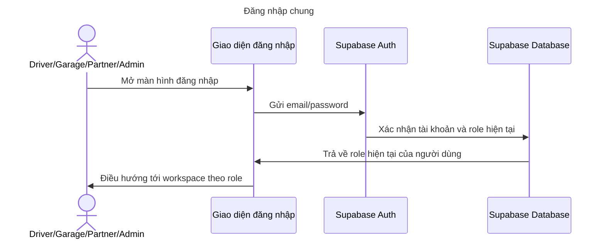

### 2. Đăng ký email/password và hoàn thiện hồ sơ Driver/Partner

**Actor chính:** Driver hoặc Partner.

**Mục tiêu:** Tách riêng đăng ký khỏi đăng nhập. Driver và Partner đăng ký bằng email/password, vào trang chọn vai trò, hoàn thiện hồ sơ ban đầu theo role, submit và chờ Platform/Admin duyệt.

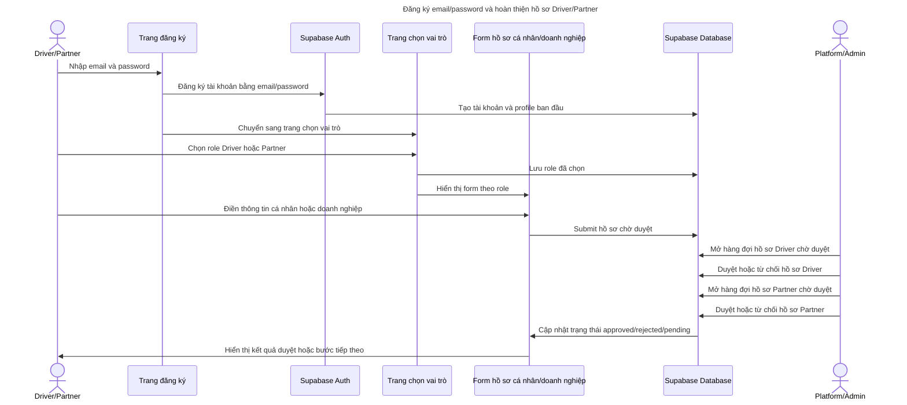

### 3. Driver gửi và cập nhật hồ sơ

**Actor chính:** Driver.

**Mục tiêu:** Driver gửi/cập nhật thông tin cá nhân và tài khoản nhận tiền.

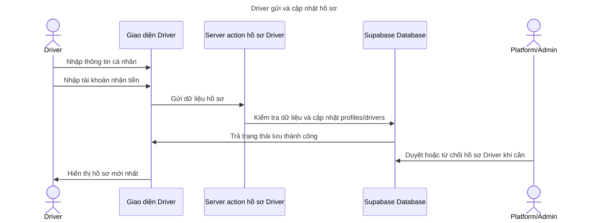

### 4. Driver chọn garage dán decal

**Actor chính:** Driver.

**Mục tiêu:** Driver chọn garage đã được duyệt để dán decal cho contract được gán.

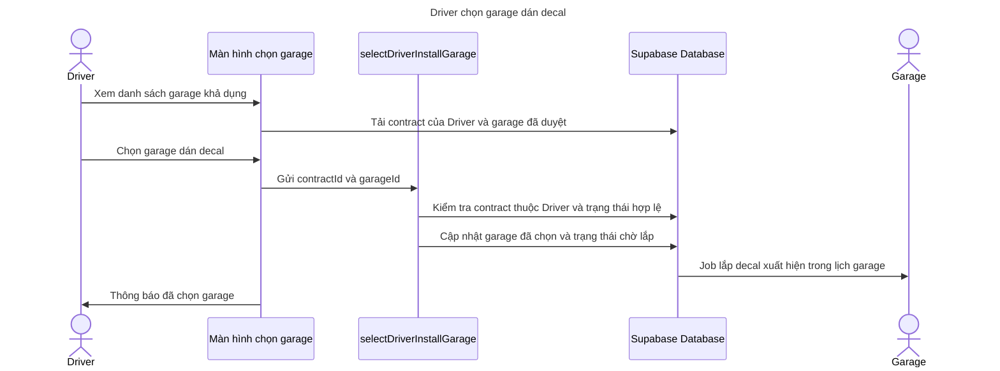

### 5. Garage dán decal và Admin duyệt ảnh sau dán

**Actor chính:** Garage và Platform/Admin.

**Mục tiêu:** Garage tải ảnh sau khi dán decal; Admin duyệt ảnh sau dán để mở earning.

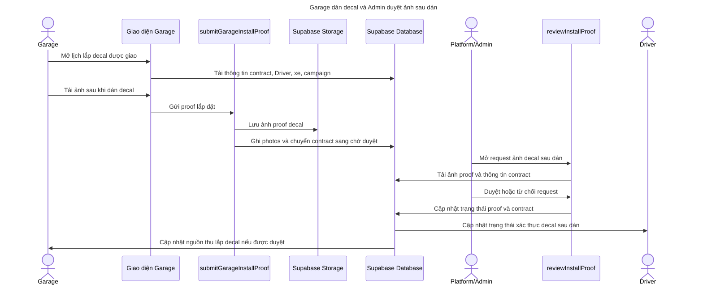

### 6. Driver gửi ảnh xác minh decal hằng tháng

**Actor chính:** Driver.

**Mục tiêu:** Driver gửi ảnh xác minh decal định kỳ mỗi tháng; Platform/Admin duyệt hoặc từ chối ảnh để cập nhật trạng thái hợp lệ.

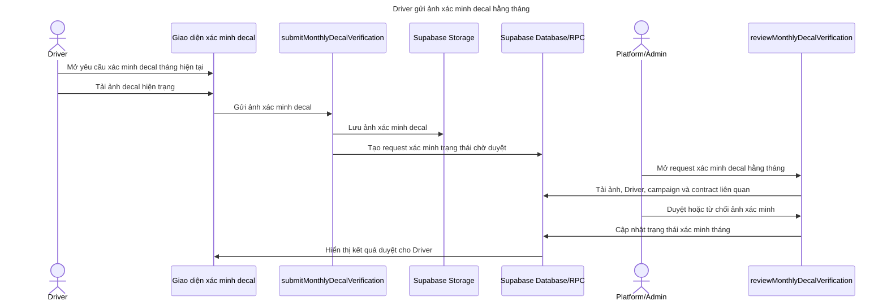

### 7. Driver xem thu nhập và yêu cầu rút tiền

**Actor chính:** Driver.

**Mục tiêu:** Driver xem thống kê thu nhập, tạo hóa đơn/rút tiền; Admin xử lý payout thủ công.

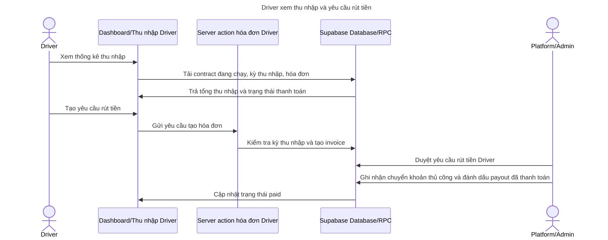

### 8. Garage cập nhật hồ sơ, xem lịch và nguồn thu

**Actor chính:** Garage.

**Mục tiêu:** Garage cập nhật thông tin, xem lịch lắp decal và thống kê nguồn thu theo tháng.

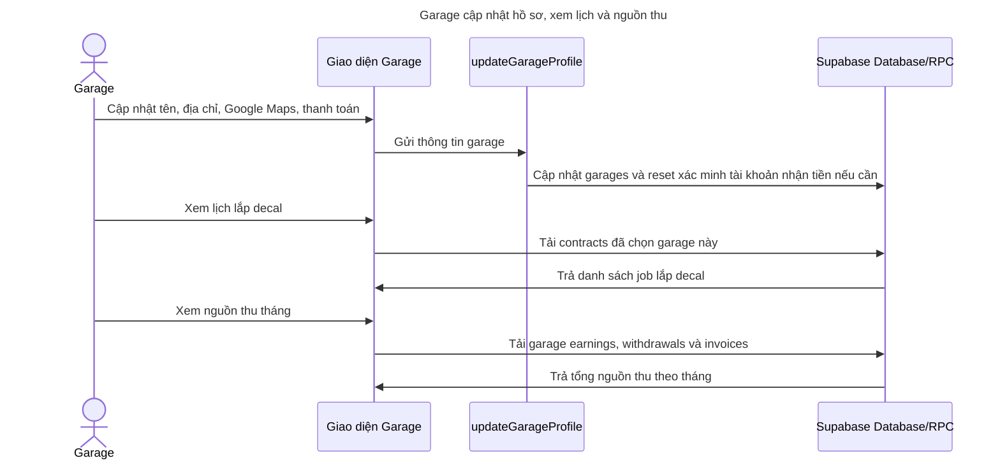

### 9. Garage yêu cầu rút tiền

**Actor chính:** Garage.

**Mục tiêu:** Garage gửi yêu cầu rút tiền từ nguồn thu; Admin duyệt và chuyển khoản thủ công.

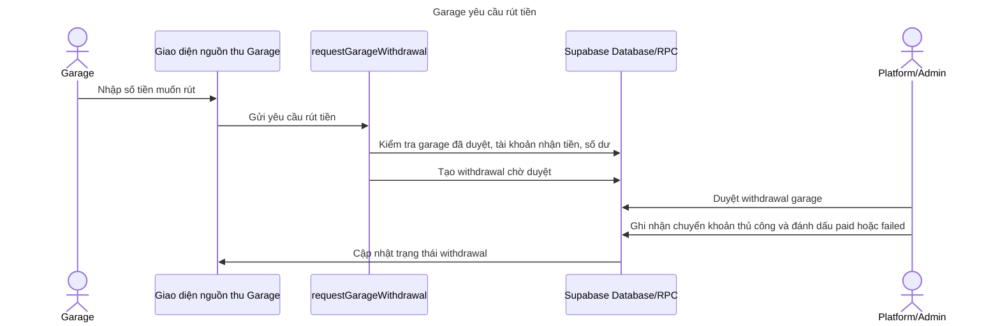

### 10. Partner gửi thông tin doanh nghiệp

**Actor chính:** Partner.

**Mục tiêu:** Partner đăng ký, gửi thông tin doanh nghiệp và chờ Admin duyệt trước khi tạo campaign.

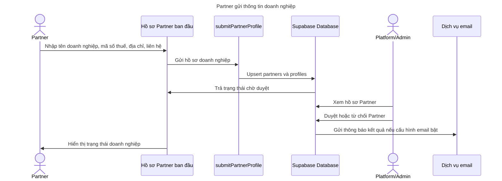

### 11. Partner nạp tiền tự động

**Actor chính:** Partner.

**Mục tiêu:** Partner nạp tiền tự động; cơ chế xác nhận giao dịch cộng ví và cập nhật dashboard.

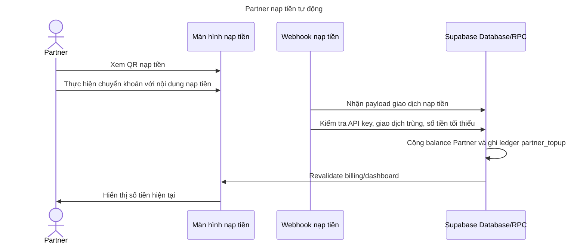

### 12. Partner tạo và chỉnh sửa campaign trước duyệt

**Actor chính:** Partner.

**Mục tiêu:** Partner tạo campaign, upload creative, chỉnh sửa trước khi Admin duyệt; Admin duyệt campaign để đưa vào vận hành.

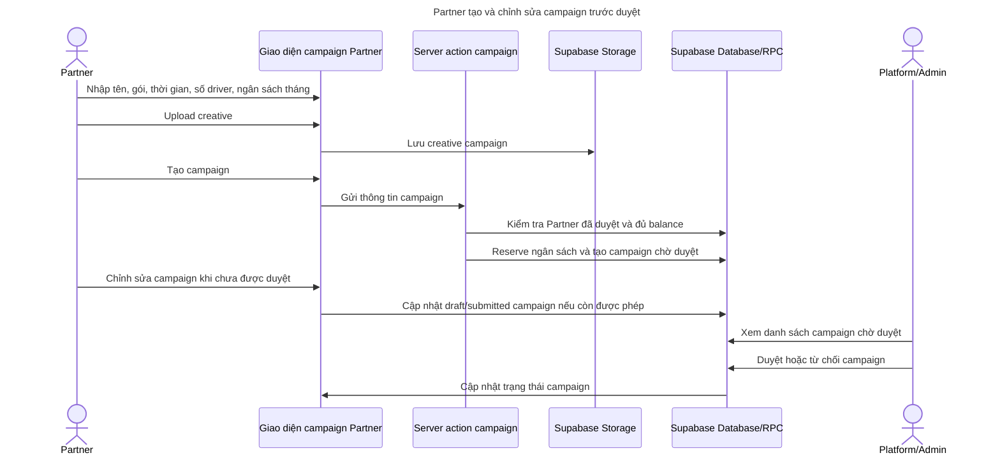

### 13. Partner xem dashboard và thống kê chi phí

**Actor chính:** Partner.

**Mục tiêu:** Partner xem dashboard thống kê và thống kê chi phí hằng tháng. Trạng thái campaign hết gói chỉ là rule/trạng thái, không phải use case riêng.

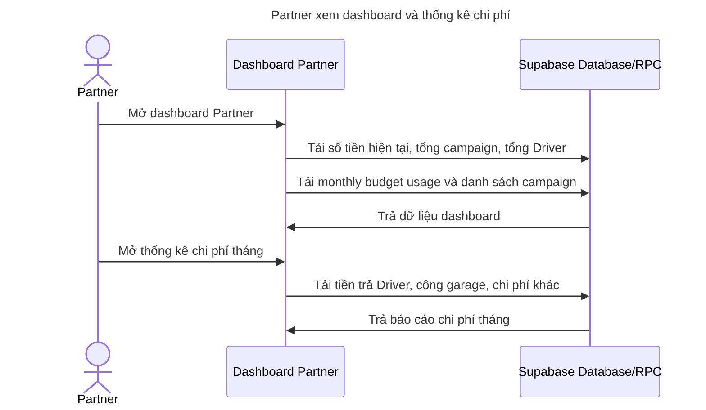

### 14. Admin dashboard, hóa đơn và lợi nhuận

**Actor chính:** Platform/Admin.

**Mục tiêu:** Admin xem dashboard hệ thống, hóa đơn và thống kê lợi nhuận.

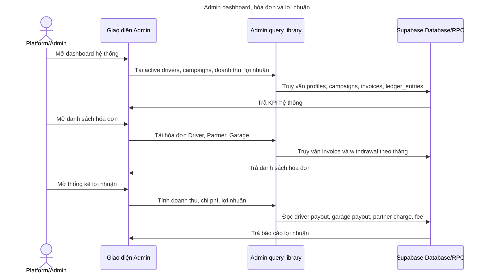

### 15. Admin gán Driver vào campaign

**Actor chính:** Platform/Admin.

**Mục tiêu:** Admin chọn Driver/xe phù hợp và gán vào campaign để tạo contract.

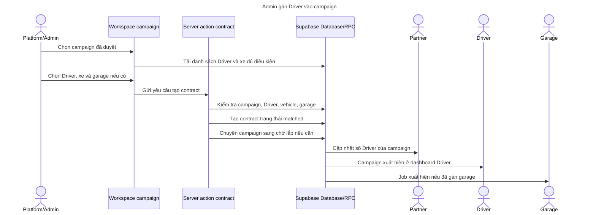

### 16. Admin quản lý payout, thông số và role

**Actor chính:** Platform/Admin.

**Mục tiêu:** Admin xử lý rút tiền, chỉnh thông số hệ thống và quản lý người dùng/role.

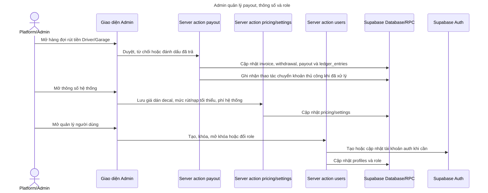

## 6. Ghi Chú Cho Phần Cần Làm Rõ

1. Nếu Partner được phép chỉnh campaign trước duyệt, cần bổ sung server action và rule chỉ cho sửa khi campaign chưa được Admin duyệt.
2. Campaign hết gói chỉ nên mô tả như rule/trạng thái của campaign, không đưa thành UC riêng.
3. Cập nhật thông tin xe không đưa thành UC riêng vì hiện không có thao tác demo rõ cho Driver.
