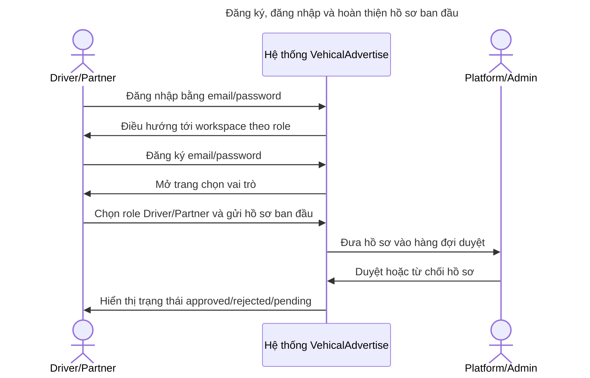
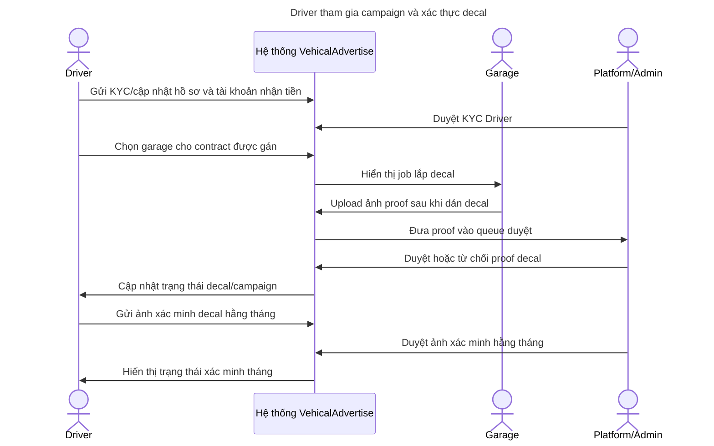
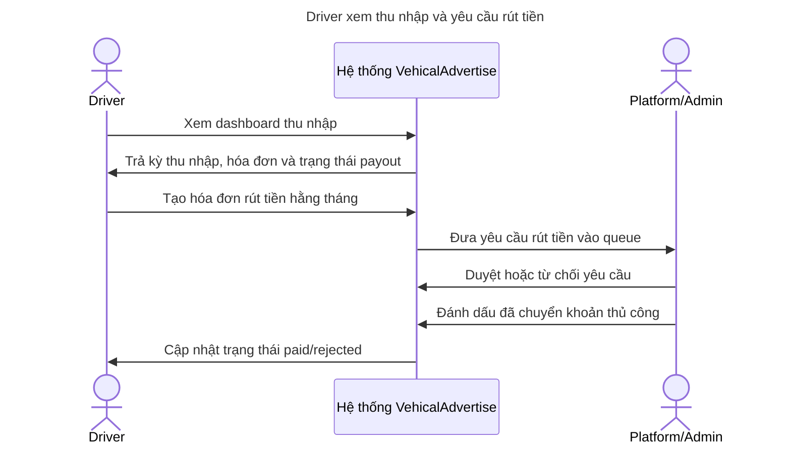
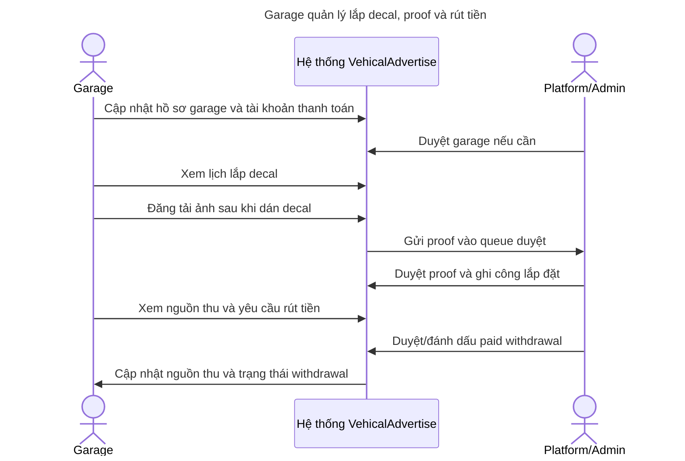
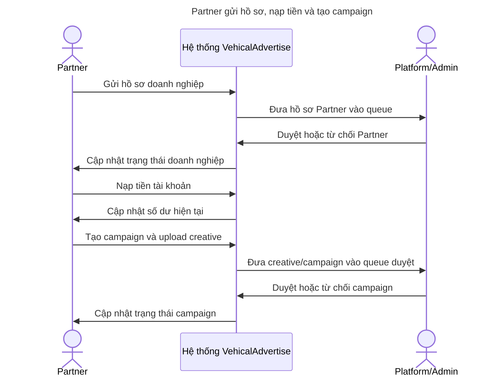
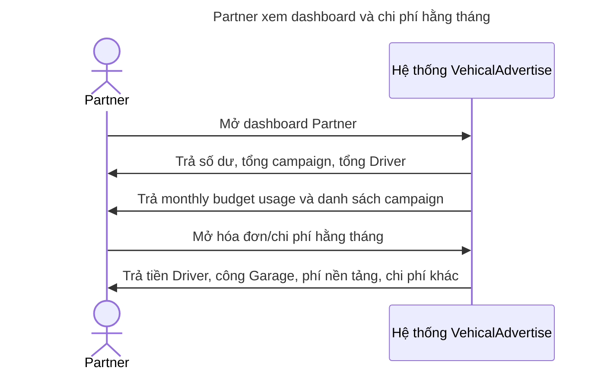
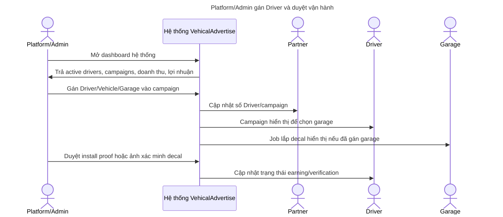
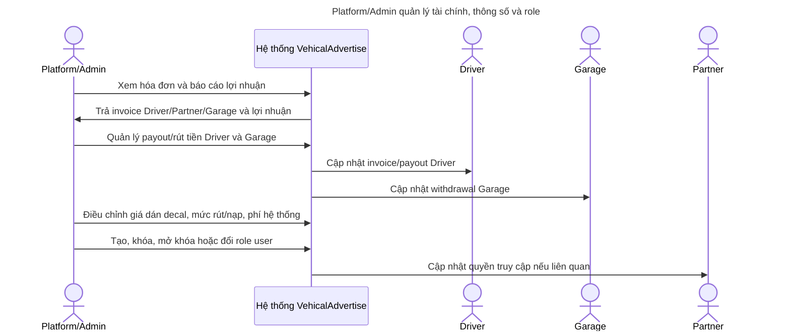

# Đồ Án: Biểu Đồ Trình Tự Các Ca Sử Dụng

## 1. Phạm Vi

Tài liệu này trình bày sequence diagram theo scope demo hiện tại của VehicalAdvertise. Bộ sequence dùng 4 actor chính: Driver, Garage, Partner và Platform/Admin. Các chi tiết kỹ thuật như Supabase Auth, Database, Storage, SePay, audit log hoặc GPS tracking không vẽ như actor/lifeline riêng trong bộ sequence tổng quát; chúng được gom vào participant **Hệ thống VehicalAdvertise**.

File import draw.io: `docs/sequence-usecases.drawio`.

## 2. Nhóm Sequence

| Trang | Nội dung                                           | Use case bao phủ            |
| ----- | -------------------------------------------------- | --------------------------- |
| 1     | Đăng ký, đăng nhập và hoàn thiện hồ sơ ban đầu     | AUTH01-AUTH04               |
| 2     | Driver tham gia campaign và xác thực decal         | D01-D05, G03, A02, A05, A06 |
| 3     | Driver xem thu nhập và yêu cầu rút tiền            | D06, A08                    |
| 4     | Garage quản lý lắp decal, proof và rút tiền        | G01-G04, A05, A08           |
| 5     | Partner gửi hồ sơ, nạp tiền và tạo campaign        | P01-P03, A02, A03           |
| 6     | Partner xem dashboard và chi phí hằng tháng        | P04-P05                     |
| 7     | Platform/Admin gán Driver và duyệt vận hành        | A01, A04-A06                |
| 8     | Platform/Admin quản lý tài chính, thông số và role | A07-A10                     |

## 3. Sequence Diagram

### 1. Đăng ký, đăng nhập và hoàn thiện hồ sơ ban đầu

### 2. Driver tham gia campaign và xác thực decal

### 3. Driver xem thu nhập và yêu cầu rút tiền

### 4. Garage quản lý lắp decal, proof và rút tiền

### 5. Partner gửi hồ sơ, nạp tiền và tạo campaign

### 6. Partner xem dashboard và chi phí hằng tháng

### 7. Platform/Admin gán Driver và duyệt vận hành

### 8. Platform/Admin quản lý tài chính, thông số và role

## 4. Ghi Chú Scope

- Partner chỉnh sửa campaign trước duyệt không vẽ trong sequence chính vì scout chưa thấy route/action update campaign từ phía Partner.
- Driver gửi ảnh xác minh decal hằng tháng được giữ theo scope đã chốt. Hiện phía Admin có queue review ảnh định kỳ; phía Driver cần route/action submit riêng nếu demo muốn thao tác đầy đủ.
- Campaign hết gói chỉ là rule/trạng thái campaign, không phải sequence/use case riêng.
- Cập nhật thông tin xe không tách thành sequence riêng; dữ liệu xe nằm trong hồ sơ/contract.
